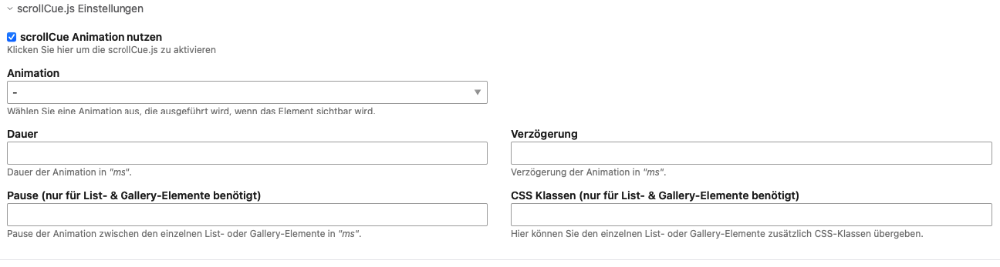

[](https://packagist.org/packages/jedocodes/contao-scrollcuejs-bundle) [](https://packagist.org/packages/jedocodes/contao-scrollcuejs-bundle) [](https://packagist.org/packages/jedocodes/contao-scrollcuejs-bundle) [](https://packagist.org/packages/jedocodes/contao-scrollcuejs-bundle) [](https://packagist.org/packages/jedocodes/contao-scrollcuejs-bundle)

# Contao scrollCue.js


Integrate scrollCue.js for a scroll animation of a Contao content element. 


## Install

1. Install via composer or use the [Contao Manager](https://docs.contao.org/books/manager/de/)

```
composer require jedocodes/contao-scrollcuejs-bundle
```

2. Open the install tool and do a database update.

3. Include the **js_scrollcuejs** template in the page layout.

-

#### Add custom animation types
Create a custom template if you want to set custom scrollCue.js options. See the [documentation](https://prjct-samwest.github.io/scrollCue/document.html) for more details. May be also add

```
/******************** 
*     foo
*********************/

[data-cue="foo"],[data-cues="foo"]>*{
  opacity: 0;
}
@keyframes foo {
  from{
    ...
  }
  to{
    opacity : 1;
    ...
  }
}


```

-

### Screenshot

